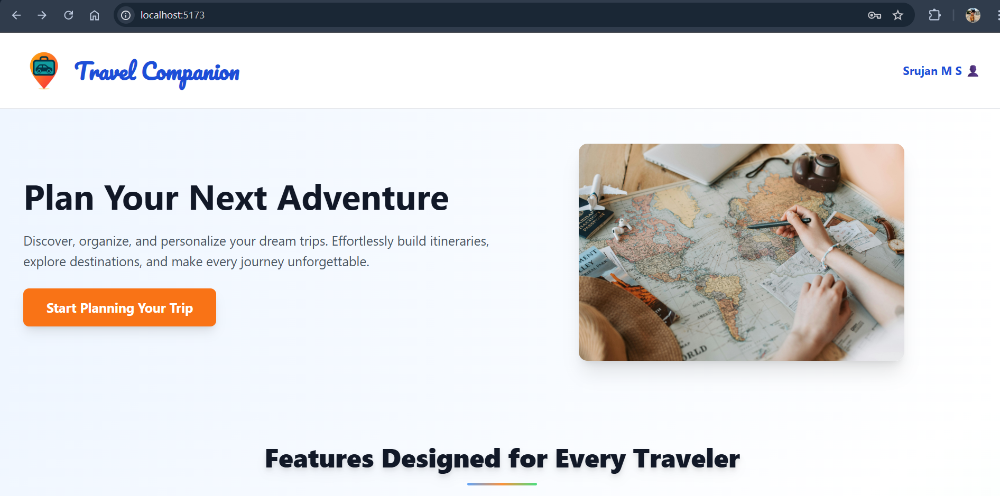
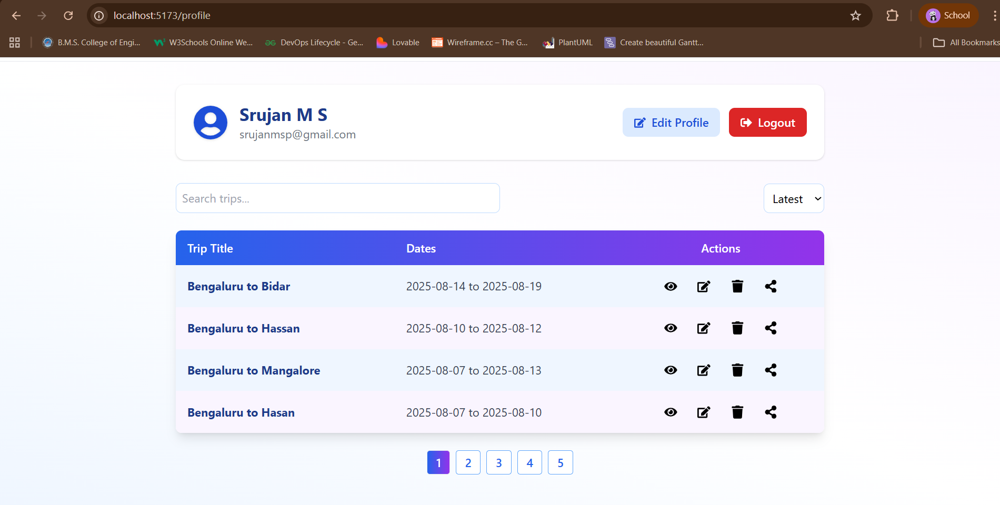
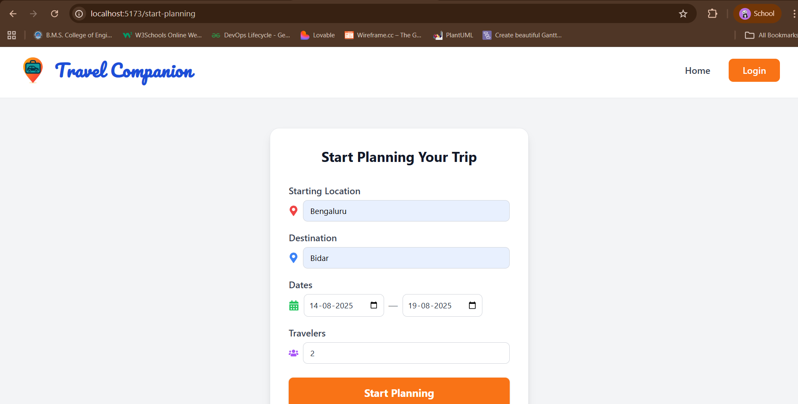
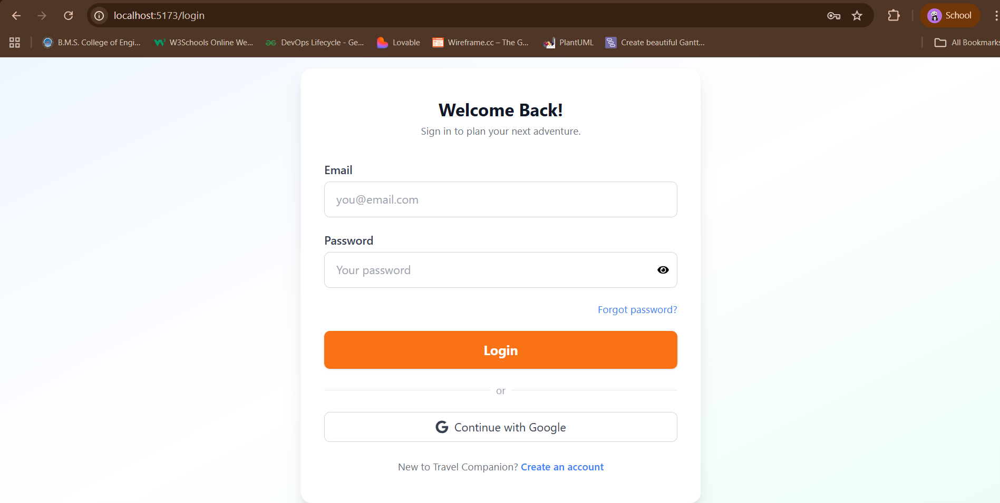

# Travel Planning Application

A full-stack Travel Planning web application that helps users organize and manage their trips efficiently. The application allows users to create travel plans, add destinations, maintain itineraries, and keep track of travel activities in one place. The goal of this project is to simplify travel planning by providing an easy-to-use interface and reliable data storage.

---

## Features

* User authentication (Sign Up / Login)
* Create and manage travel plans
* Add destinations and itinerary details
* Map integration for route planning
* Edit and delete travel plans
* View saved trips in a dashboard
* Responsive and user-friendly interface
* RESTful API integration
* Secure data storage with database

---

## Tech Stack

### Frontend

* React.js
* HTML5
* CSS3
* JavaScript

### Backend

* Node.js
* Express.js

### Database

* MongoDB

### Tools

* Git
* GitHub
* Postman
* npm

---

## Project Structure

travel_companion
│
├── backend
│   ├── config
│   ├── controllers
│   ├── models
│   ├── routes
│   ├── middleware
│   └── server.js
│
├── node_modules
│
├── public
│
├── Screenshots
│   ├── home.png
│   ├── dashboard.png
│   └── create-trip.png
│
├── src
│   ├── .vscode
│   │
│   ├── assets
│   │
│   ├── components
│   │
│   ├── context
│   │
│   ├── hooks
│   │
│   ├── pages
│   │
│   ├── routes
│   │
│   ├── utils
│   │
│   ├── App.css
│   ├── App.jsx
│   ├── index.css
│   └── main.jsx
│
├── .env
├── .gitignore
├── eslint.config.js
├── index.html
├── package.json
├── package-lock.json
├── postcss.config.js
├── tailwind.config.js
├── vite.config.js
└── README.md

---

## Installation and Setup

### 1. Clone the repository

git clone https://github.com/Srujanmsp/travel_companion.git

### 2. Navigate to the project folder

cd travel_companion

### 3. Install dependencies

Install frontend dependencies:

npm install

Install backend dependencies:

cd backend
npm install

### 4. Run the application

Start the backend server:

cd backend
npm start

Start the frontend application:

cd ..
npm run dev

---

## 📸 Screenshots

### Home Page

### Travel Dashboard

### Create Trip Page

### User Login

More screenshots of the application, including budget planning, activity planning, stop management, and checklist features, can be found in the Screenshots folder in this repository.

---

## 📌 Future Improvements

* Integration with travel APIs for destination information
* Hotel and flight recommendations
* Weather information for destinations
* Mobile responsive improvements
* Deployment with cloud services

---

## 👨‍💻 Author

This project was developed as a full-stack application using the MERN stack for learning and demonstration purposes.

---

## 📄 License

This project is created for educational and learning purposes.
